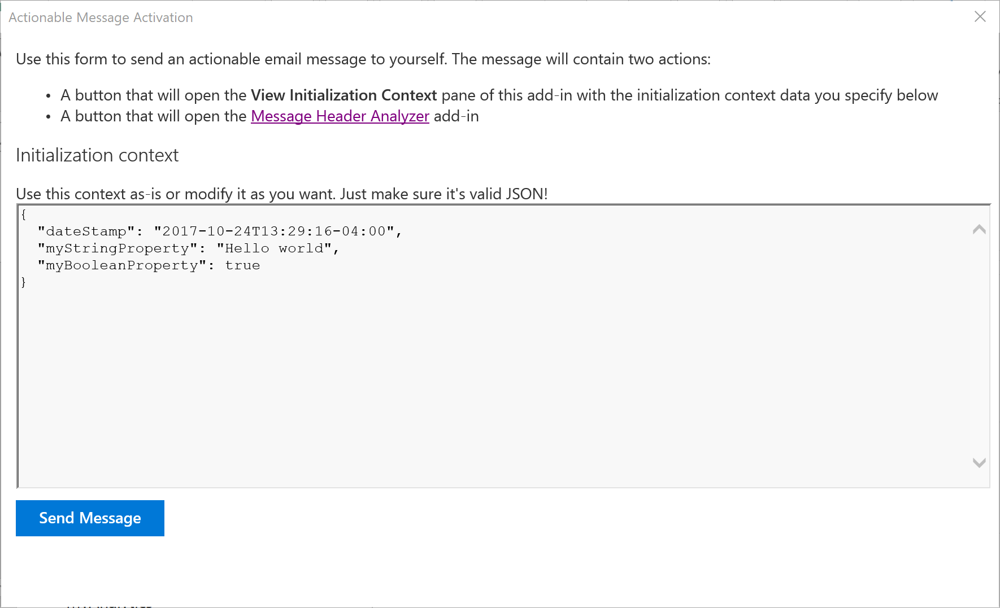

# Outlook Add-in: Actionable Message Activation

The sample demonstrates how to [activate an add-in from an actionable message](https://docs.microsoft.com/outlook/actionable-messages/invoke-add-in-from-actionable-message) and pass an intialization context to the add-in.

## Running the sample

In order to run this sample, you will need to host the included files on a web server. The choice of web server is completely up to you. The only requirement is that the web server be protected by a valid SSL certificate. 

### Update the manifest

Before loading the add-in, you must update the [manifest](actionable-add-in.xml) to replace all instances of `localhost:8080` with the base URL of the server where you are hosting your add-in.

### Install the add-in

Follow the instructions in [Sideload Outlook add-ins for testing](https://docs.microsoft.com/en-us/outlook/add-ins/sideload-outlook-add-ins-for-testing) to sideload the `actionable-add-in.xml` file to install the add-in.

### Use the add-in

The add-in adds two buttons to the ribbon when you are reading email messages.

- **Send Add-in Activation** - This button allows you to send yourself an actionable email message with buttons that invoke add-ins.
- **View Initialization Context** - This button opens a taskpane and displays the current initialization context (if present).

> **Note:** The initialization context is only present when the taskpane is invoked from an actionable message. If you open the taskpane by using the ribbon button, you will see a message letting you know that you need to invoke the add-in from a message.
>
> 

1. Click the **Send Add-in Activation** button. A dialog opens to send the message: 

    
1. (Optional): Modify the initialization context.
1. Click the **Send Message** button.
1. When the message arrives in your inbox, open it.

    
1. Click the **Invoke "View Initialization Context"** button.
1. The add-in taskpane opens and displays the initialization context.

    

### Try on-demand installation of store add-in

You can use the second button in the actionable message to see how on-demand installation of store add-ins works. Before trying it, if you already have the [Message Header Analyzer](https://appsource.microsoft.com/en-us/product/office/WA104005406), be sure to uninstall it.

This project has adopted the [Microsoft Open Source Code of Conduct](https://opensource.microsoft.com/codeofconduct/). For more information, see the [Code of Conduct FAQ](https://opensource.microsoft.com/codeofconduct/faq/) or contact [opencode@microsoft.com](mailto:opencode@microsoft.com) with any additional questions or comments.
